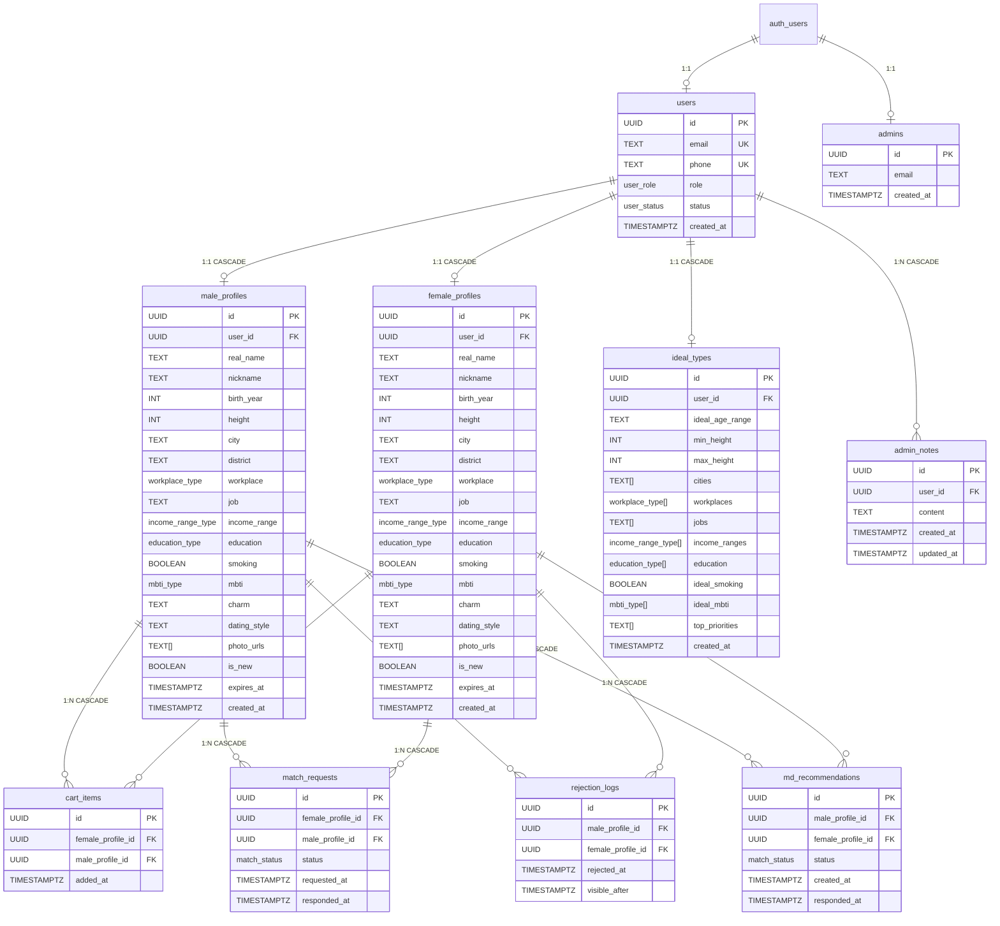

# 데이터베이스 스키마 설계

## 전체 관계도



---

## CASCADE 흐름

```
users 삭제
├── male_profiles        (ON DELETE CASCADE)
│   ├── cart_items          (ON DELETE CASCADE)
│   ├── match_requests      (ON DELETE CASCADE)
│   ├── rejection_logs      (ON DELETE CASCADE)
│   └── md_recommendations  (ON DELETE CASCADE)
├── female_profiles      (ON DELETE CASCADE)
│   ├── cart_items          (ON DELETE CASCADE)
│   ├── match_requests      (ON DELETE CASCADE)
│   ├── rejection_logs      (ON DELETE CASCADE)
│   └── md_recommendations  (ON DELETE CASCADE)
├── ideal_types          (ON DELETE CASCADE)
└── admin_notes          (ON DELETE CASCADE)
```

> `users` 레코드 하나를 삭제하면 연관된 모든 데이터가 자동으로 삭제된다.

---

## 테이블 요약

| 테이블 | 역할 | 종속 관계 |
|--------|------|-----------|
| `users` | 일반 유저 인증 / 상태 관리 | Supabase `auth.users` |
| `admins` | 관리자 계정 | Supabase `auth.users` |
| `male_profiles` | 남성 프로필 | `users` 1:1 |
| `female_profiles` | 여성 프로필 | `users` 1:1 |
| `ideal_types` | 이상형 (관리자 상세 조회 시 join) | `users` 1:1 |
| `cart_items` | 여성 장바구니 (female → male 담기) | `female_profiles`, `male_profiles` |
| `match_requests` | 매칭 요청 및 응답 | `female_profiles`, `male_profiles` |
| `rejection_logs` | 거절 기록 + 1주일 쿨타임 관리 | `male_profiles`, `female_profiles` |
| `md_recommendations` | MD 추천 (관리자 → 남성에게 여성 추천) | `male_profiles`, `female_profiles` |
| `admin_notes` | 관리자 메모 (유저별) | `users` 1:N |

---

## ENUM 타입 정의

### user_status
| 값 | 설명 |
|----|------|
| `pending` | 승인 대기 (회원가입 직후 기본값) |
| `active` | 활성 (관리자 승인 완료) |
| `blocked` | 블락 (수동 또는 만료일 초과 시 자동) |
| `rejected` | 반려 (관리자 반려, 데이터 삭제) |

### user_role
| 값 | 설명 |
|----|------|
| `male` | 남성 유저 |
| `female` | 여성 유저 |

### workplace_type
`대기업` / `중견기업` / `중소기업` / `공기업` / `공무원` / `전문직` / `개인사업/자영업` / `프리랜서`

### income_range_type
| 값 |
|----|
| `3000만원 미만` |
| `3000만원 이상 4000만원 미만` |
| `4000만원 이상 6000만원 미만` |
| `6000만원 이상 8000만원 미만` |
| `8000만원 이상 1억 미만` |
| `1억 이상 1억5천만원 미만` |
| `1억5천만원 이상 2억 미만` |
| `2억 이상` |
| `3억 이상` |

### education_type
| 값 |
|----|
| `박사 졸업` |
| `석사 졸업` |
| `SKY카포 졸업` |
| `의대/치대/약대/한의대 졸업` |
| `로스쿨/경찰대/사관학교 졸업` |
| `해외대학교 졸업` |
| `서울 4년제 졸업` |
| `기타 4년제 졸업` |
| `전문대학교 졸업` |
| `고등학교 졸업` |

### smoking
흡연 여부는 BOOLEAN으로 처리: `true` = 유, `false` = 무

### mbti_type
`INTJ` / `INTP` / `ENTJ` / `ENTP` / `INFJ` / `INFP` / `ENFJ` / `ENFP`
`ISTJ` / `ISFJ` / `ESTJ` / `ESFJ` / `ISTP` / `ISFP` / `ESTP` / `ESFP`

---

## SQL 전문

```sql
-- ── ENUM 타입 정의 ────────────────────────────────────────────────

CREATE TYPE user_status AS ENUM (
  'pending',
  'active',
  'blocked',
  'rejected'
);

CREATE TYPE user_role AS ENUM (
  'male',
  'female'
);

CREATE TYPE workplace_type AS ENUM (
  '대기업',
  '중견기업',
  '중소기업',
  '공기업',
  '공무원',
  '전문직',
  '개인사업/자영업',
  '프리랜서'
);

CREATE TYPE income_range_type AS ENUM (
  '3000만원 미만',
  '3000만원 이상 4000만원 미만',
  '4000만원 이상 6000만원 미만',
  '6000만원 이상 8000만원 미만',
  '8000만원 이상 1억 미만',
  '1억 이상 1억5천만원 미만',
  '1억5천만원 이상 2억 미만',
  '2억 이상',
  '3억 이상'
);

CREATE TYPE education_type AS ENUM (
  '박사 졸업',
  '석사 졸업',
  'SKY카포 졸업',
  '의대/치대/약대/한의대 졸업',
  '로스쿨/경찰대/사관학교 졸업',
  '해외대학교 졸업',
  '서울 4년제 졸업',
  '기타 4년제 졸업',
  '전문대학교 졸업',
  '고등학교 졸업'
);

-- smoking은 BOOLEAN (true=유, false=무)으로 처리, ENUM 불필요

CREATE TYPE mbti_type AS ENUM (
  'INTJ', 'INTP', 'ENTJ', 'ENTP',
  'INFJ', 'INFP', 'ENFJ', 'ENFP',
  'ISTJ', 'ISFJ', 'ESTJ', 'ESFJ',
  'ISTP', 'ISFP', 'ESTP', 'ESFP'
);

CREATE TYPE match_status AS ENUM (
  'pending',
  'approved',
  'rejected'
);

-- ── 인증 ─────────────────────────────────────────────────────────

CREATE TABLE users (
  id         UUID PRIMARY KEY REFERENCES auth.users(id),
  email      TEXT UNIQUE NOT NULL,
  phone      TEXT UNIQUE NOT NULL,
  role       user_role NOT NULL,
  status     user_status NOT NULL DEFAULT 'pending',
  created_at TIMESTAMPTZ DEFAULT now(),
  UNIQUE (id, email, phone)
);

CREATE TABLE admins (
  id         UUID PRIMARY KEY REFERENCES auth.users(id),
  email      TEXT UNIQUE NOT NULL,
  created_at TIMESTAMPTZ DEFAULT now()
);

-- ── 프로필 ───────────────────────────────────────────────────────

CREATE TABLE male_profiles (
  id           UUID PRIMARY KEY DEFAULT gen_random_uuid(),
  user_id      UUID UNIQUE NOT NULL REFERENCES users(id) ON DELETE CASCADE,
  real_name    TEXT NOT NULL,
  nickname     TEXT NOT NULL,
  birth_year   INT,
  height       INT,
  city         TEXT,
  district     TEXT,
  workplace    workplace_type,
  job          TEXT,
  income_range income_range_type,
  education    education_type,
  smoking      BOOLEAN DEFAULT false,
  mbti         mbti_type,
  charm        TEXT,
  dating_style TEXT,
  photo_urls   TEXT[],
  is_new       BOOLEAN DEFAULT true,
  expires_at   TIMESTAMPTZ,
  created_at   TIMESTAMPTZ DEFAULT now()
);

CREATE TABLE female_profiles (
  id           UUID PRIMARY KEY DEFAULT gen_random_uuid(),
  user_id      UUID UNIQUE NOT NULL REFERENCES users(id) ON DELETE CASCADE,
  real_name    TEXT NOT NULL,
  nickname     TEXT NOT NULL,
  birth_year   INT,
  height       INT,
  city         TEXT,
  district     TEXT,
  workplace    workplace_type,
  job          TEXT,
  income_range income_range_type,
  education    education_type,
  smoking      BOOLEAN DEFAULT false,
  mbti         mbti_type,
  charm        TEXT,
  dating_style TEXT,
  photo_urls   TEXT[],
  is_new       BOOLEAN DEFAULT true,
  expires_at   TIMESTAMPTZ,
  created_at   TIMESTAMPTZ DEFAULT now()
);

-- 이상형 (관리자 상세 조회 시에만 join)
CREATE TABLE ideal_types (
  id              UUID PRIMARY KEY DEFAULT gen_random_uuid(),
  user_id         UUID UNIQUE NOT NULL REFERENCES users(id) ON DELETE CASCADE,
  ideal_age_range TEXT,
  min_height      INT,
  max_height      INT,
  cities          TEXT[],
  workplaces      workplace_type[],
  jobs            TEXT[],
  income_ranges   income_range_type[],
  education       education_type[],
  ideal_smoking   BOOLEAN,
  ideal_mbti      mbti_type[],
  top_priorities  TEXT[],
  created_at      TIMESTAMPTZ DEFAULT now()
);

-- ── female 종속 ──────────────────────────────────────────────────

CREATE TABLE cart_items (
  id                UUID PRIMARY KEY DEFAULT gen_random_uuid(),
  female_profile_id UUID NOT NULL REFERENCES female_profiles(id) ON DELETE CASCADE,
  male_profile_id   UUID NOT NULL REFERENCES male_profiles(id) ON DELETE CASCADE,
  added_at          TIMESTAMPTZ DEFAULT now(),
  UNIQUE (female_profile_id, male_profile_id)
);

-- ── male 종속 ────────────────────────────────────────────────────

CREATE TABLE match_requests (
  id                UUID PRIMARY KEY DEFAULT gen_random_uuid(),
  female_profile_id UUID NOT NULL REFERENCES female_profiles(id) ON DELETE CASCADE,
  male_profile_id   UUID NOT NULL REFERENCES male_profiles(id) ON DELETE CASCADE,
  status            match_status NOT NULL DEFAULT 'pending',
  requested_at      TIMESTAMPTZ DEFAULT now(),
  responded_at      TIMESTAMPTZ,
  UNIQUE (female_profile_id, male_profile_id)
);

-- ── 독립 다대다 ──────────────────────────────────────────────────

CREATE TABLE rejection_logs (
  id                UUID PRIMARY KEY DEFAULT gen_random_uuid(),
  male_profile_id   UUID NOT NULL REFERENCES male_profiles(id) ON DELETE CASCADE,
  female_profile_id UUID NOT NULL REFERENCES female_profiles(id) ON DELETE CASCADE,
  rejected_at       TIMESTAMPTZ DEFAULT now(),
  visible_after     TIMESTAMPTZ GENERATED ALWAYS AS
                    (rejected_at + INTERVAL '7 days') STORED,
  UNIQUE (male_profile_id, female_profile_id)
);

-- ── MD 추천 ─────────────────────────────────────────────────────

CREATE TABLE md_recommendations (
  id                UUID PRIMARY KEY DEFAULT gen_random_uuid(),
  male_profile_id   UUID NOT NULL REFERENCES male_profiles(id) ON DELETE CASCADE,
  female_profile_id UUID NOT NULL REFERENCES female_profiles(id) ON DELETE CASCADE,
  status            match_status NOT NULL DEFAULT 'pending',
  created_at        TIMESTAMPTZ DEFAULT now(),
  responded_at      TIMESTAMPTZ,
  UNIQUE (male_profile_id, female_profile_id)
);

-- ── 관리자 메모 ──────────────────────────────────────────────────

CREATE TABLE admin_notes (
  id         UUID PRIMARY KEY DEFAULT gen_random_uuid(),
  user_id    UUID NOT NULL REFERENCES users(id) ON DELETE CASCADE,
  content    TEXT NOT NULL,
  created_at TIMESTAMPTZ DEFAULT now(),
  updated_at TIMESTAMPTZ DEFAULT now()
);

-- RLS: admin_notes는 관리자만 접근 가능 (일반 회원 API에 절대 노출 금지)
ALTER TABLE admin_notes ENABLE ROW LEVEL SECURITY;

CREATE POLICY admin_notes_admin_only ON admin_notes
  FOR ALL
  USING (
    auth.uid() IN (SELECT id FROM admins)
  )
  WITH CHECK (
    auth.uid() IN (SELECT id FROM admins)
  );

-- ── 인덱스 ───────────────────────────────────────────────────────

CREATE INDEX idx_admin_notes_user ON admin_notes(user_id, created_at DESC);

-- 목록 조회
CREATE INDEX idx_male_profiles_created_at   ON male_profiles(created_at DESC);
CREATE INDEX idx_female_profiles_created_at ON female_profiles(created_at DESC);

-- 관리자 승인 대기 목록
CREATE INDEX idx_users_status ON users(status);

-- 만료일 크론 대상 스캔
CREATE INDEX idx_male_profiles_expires_at   ON male_profiles(expires_at);
CREATE INDEX idx_female_profiles_expires_at ON female_profiles(expires_at);

-- 쿨타임 필터
CREATE INDEX idx_rejection_logs_female ON rejection_logs(female_profile_id, visible_after);

-- 매칭 요청 조회
CREATE INDEX idx_match_requests_male   ON match_requests(male_profile_id, status);
CREATE INDEX idx_match_requests_female ON match_requests(female_profile_id, status);

-- 장바구니 조회
CREATE INDEX idx_cart_items_female ON cart_items(female_profile_id);

-- MD 추천 조회
CREATE INDEX idx_md_recommendations_male ON md_recommendations(male_profile_id, status);
```

---

## 주요 쿼리 패턴

### 목록 조회 (join 없음)
```sql
SELECT * FROM male_profiles
WHERE user_id IN (SELECT id FROM users WHERE status = 'active')
ORDER BY created_at DESC
LIMIT 20 OFFSET :offset;
```

### 관리자 상세 조회 (이상형 join)
```sql
SELECT mp.*, it.*
FROM male_profiles mp
JOIN ideal_types it ON it.user_id = mp.user_id
WHERE mp.id = :male_profile_id;
```

### 크론 - 만료일 자동 블락
```sql
UPDATE users SET status = 'blocked'
WHERE id IN (
  SELECT user_id FROM male_profiles   WHERE expires_at < now()
  UNION
  SELECT user_id FROM female_profiles WHERE expires_at < now()
)
AND status = 'active';
```

### 여성 브라우징 - 쿨타임 남성 제외
```sql
SELECT mp.* FROM male_profiles mp
JOIN users u ON u.id = mp.user_id
WHERE u.status = 'active'
  AND mp.id NOT IN (
    SELECT male_profile_id FROM rejection_logs
    WHERE female_profile_id = :my_female_profile_id
      AND visible_after > now()
  )
ORDER BY mp.created_at DESC
LIMIT 20 OFFSET :offset;
```

### 남성 - 나를 선택한 여성 목록 (매칭 요청 + MD 추천 통합)
```sql
SELECT fp.*, mr.status, mr.requested_at, 'match_request' AS source
FROM match_requests mr
JOIN female_profiles fp ON fp.id = mr.female_profile_id
WHERE mr.male_profile_id = :my_male_profile_id

UNION ALL

SELECT fp.*, md.status, md.created_at AS requested_at, 'md_recommendation' AS source
FROM md_recommendations md
JOIN female_profiles fp ON fp.id = md.female_profile_id
WHERE md.male_profile_id = :my_male_profile_id

ORDER BY requested_at DESC;
```
