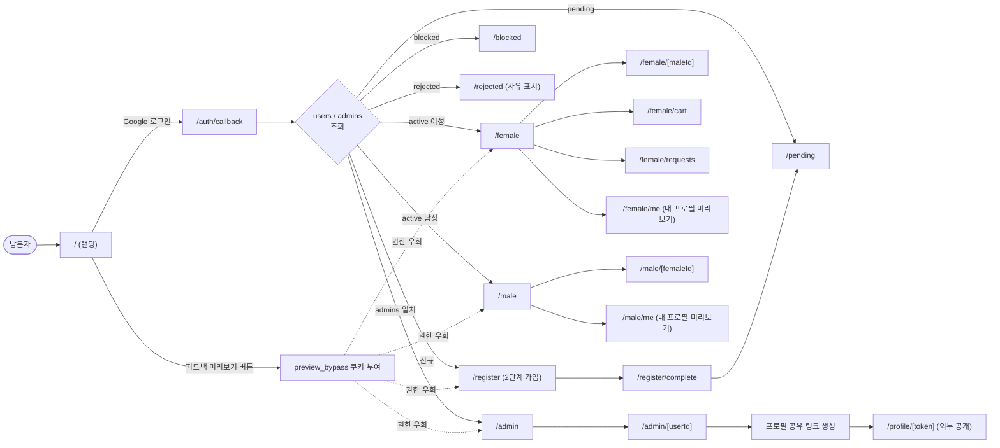
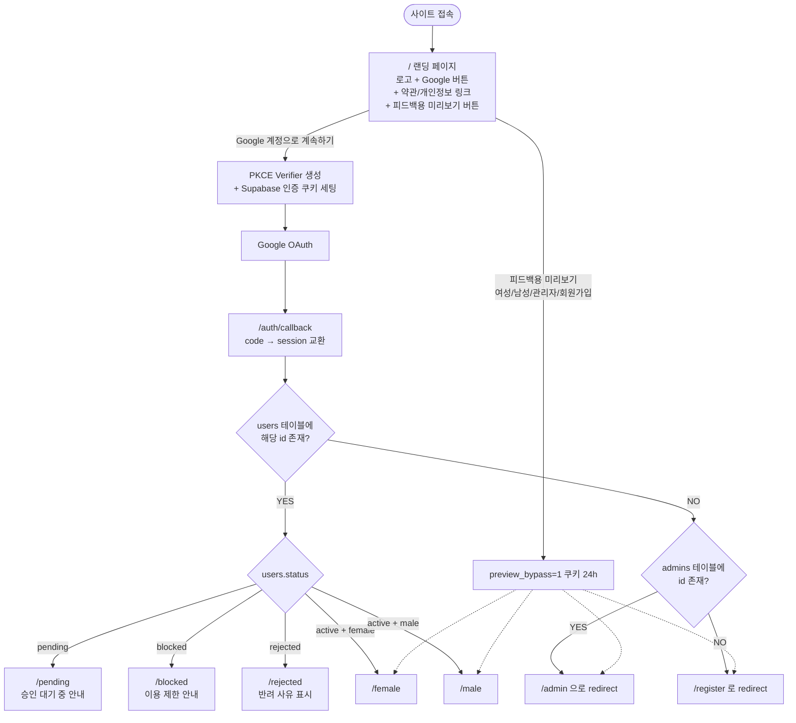
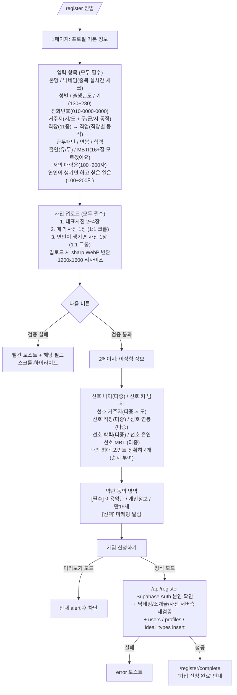
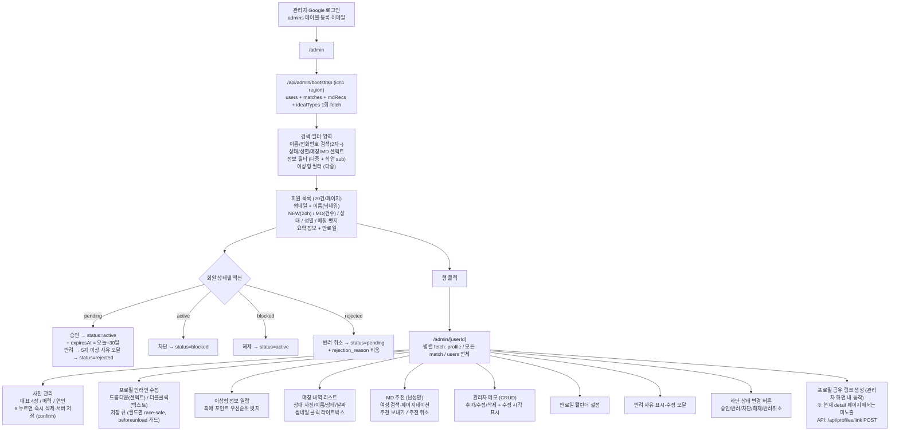
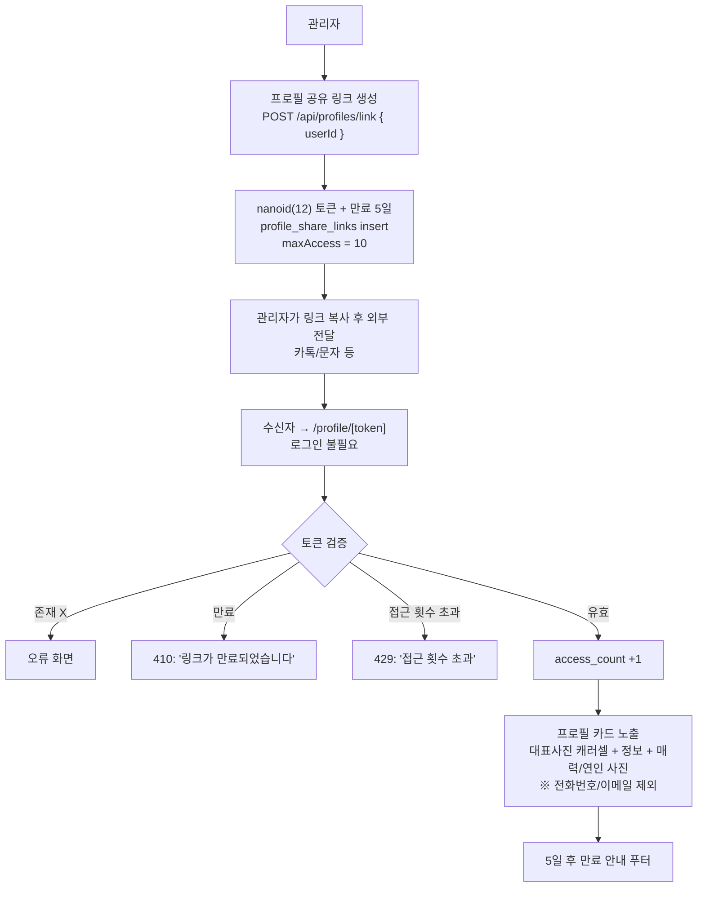
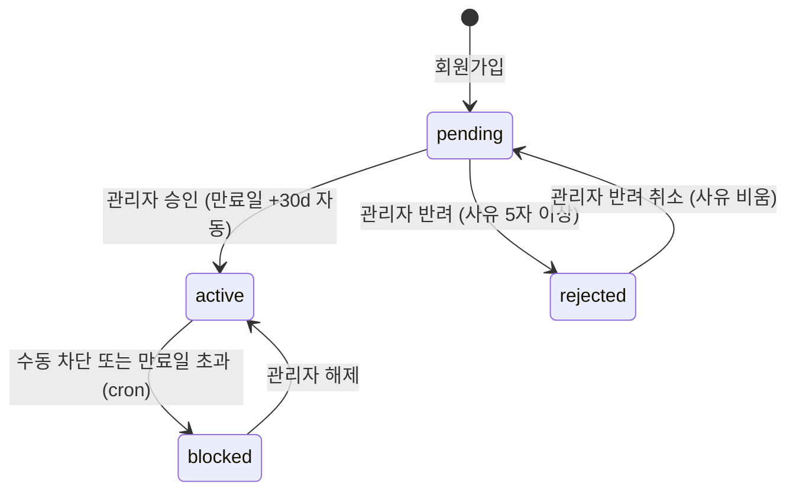
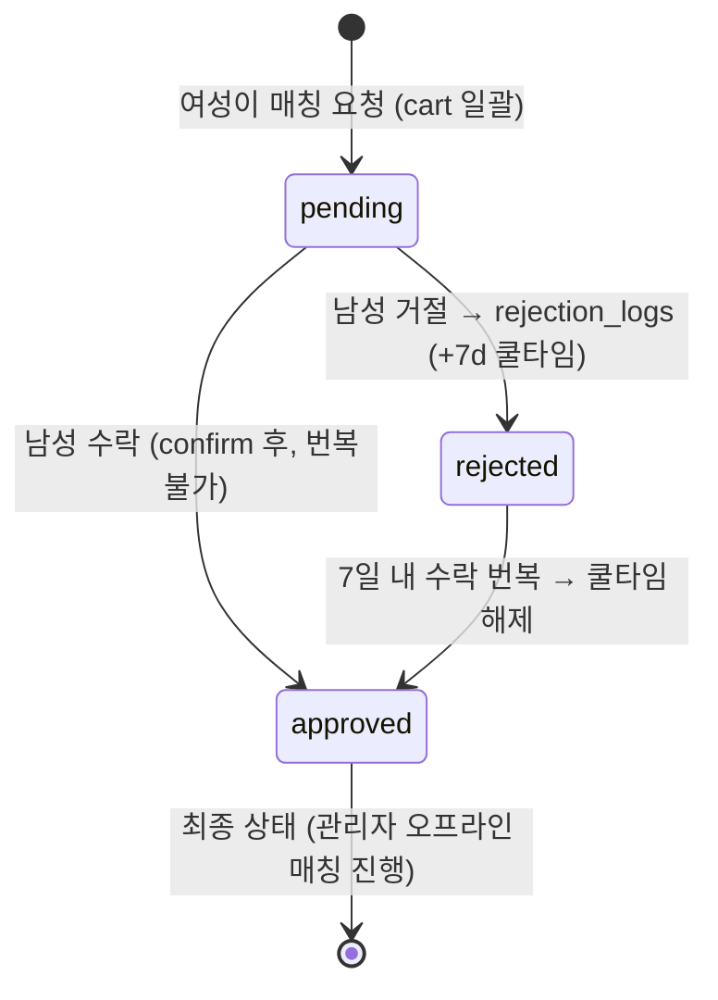
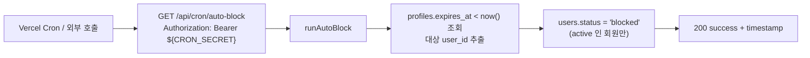

# MOSO (모두의 소개팅) — 전체 기능 플로우

> 문서 종류: Notion Import 용 플로우 명세
> 대상: 현재 개발이 완료된 전체 시스템 (랜딩 → 가입 → 사용 → 관리자 → 공유 링크 → 운영 자동화)
> 작성 기준: 코드베이스 실제 구현 (`src/app`, `src/lib`, `src/components`, `src/middleware.ts`)
>
> 본 문서는 `docs/SPEC.md`, `docs/SPEC_NOTION.md` 의 **초기 기획 명세**를 베이스로,
> 실제 구현되어 있는 모든 기능과 추후 외부 링크 전달이 필요한 항목까지 포함하여
> **현재 시점의 “있는 그대로(as-is)” 플로우**를 한 번에 정리한 문서입니다.

---

## 0. 한눈에 보기



---

## 1. 전체 서비스 플로우 (다이어그램)

### 1-1. 랜딩 → 인증 → 상태 분기



### 1-2. 회원가입 (2단계, /register)



### 1-3. 여성 회원 사용 플로우

```mermaid
flowchart TD
    FemaleHome["/female<br>남성 프로필 갤러리"] --> FilterCool[7일 쿨타임 남성 자동 제외<br>rejection_logs.visible_after > now]
    FilterCool --> Source["GET /api/profiles?role=male&status=active<br>(edge 60s 캐시 + SWR)"]
    Source --> Cards[그리드 카드 리스트<br>1열/2열 토글, 무한스크롤]

    Cards --> Filter["정보 필터 (바텀시트)<br>출생년도/키/거주지/흡연/MBTI/학력/직장<br>+ 직장 1개 선택 시 직업 sub-filter"]
    Cards --> Heart{하트 토글}
    Heart -->|active 여성| Cart["/api/cart POST/DELETE<br>cart_items 갱신 (낙관적 업데이트)"]
    Heart -->|미로그인/pending/blocked/rejected| GuardAlert[안내 alert]

    Cards --> ClickCard[카드 클릭]
    ClickCard --> SaveScroll[sessionStorage 에 스크롤 저장]
    SaveScroll --> MaleDetail["/female/[maleId]<br>대표사진 캐러셀 + 정보 + 매력/연인 사진"]

    MaleDetail --> CartBtn[하단 고정 버튼<br>매칭 후보 담기/빼기]

    Cards --> CartLink[헤더의 '매칭 후보' 링크]
    CartLink --> CartPage["/female/cart"]

    CartPage --> CartList[담은 목록 + 개별 X 제거]
    CartList --> SendBtn[N명에게 매칭 요청 보내기]
    SendBtn --> SendAPI["/api/match POST<br>cooldown 제외 후 upsert<br>cart_items 비우기"]
    SendAPI --> SendDone[성공 화면 + 돌아가기]

    CartPage --> SentList[하단 고정<br>매칭 요청 보낸 남성 (가로 스크롤)]

    Cards --> Sidebar[헤더 햄버거 → 사이드바]
    Sidebar --> RequestsLink[매칭요청 결과]
    RequestsLink --> RequestsPage["/female/requests<br>탭: 전체/대기중/수락/거절<br>상태별 메시지 카드"]
    Sidebar --> MePage["/female/me<br>내 프로필 미리보기 (이성 시점)"]
```

### 1-4. 남성 회원 사용 플로우

```mermaid
flowchart TD
    MaleHome["/male<br>매칭 요청 + MD 추천 갤러리"] --> Fetch["병렬 fetch<br>1) /api/profiles?role=female&status=active<br>2) /api/match?maleId=me (matches + mdRecs)"]

    Fetch --> Visibility["서버 측 가시성 필터<br>pending: 요청일 +30일<br>approved/rejected: 응답일 +7일"]
    Visibility --> Has{매칭 카드 있음?}

    Has -->|없음| Empty["EmptyState<br>유쾌한 안내 + 랜덤 팁 3종"]
    Has -->|있음| Cards["그리드 카드<br>대기중 / 매칭요청 보냄 / 거절됨 뱃지<br>MD 추천 뱃지<br>1열/2열 토글, 무한스크롤"]

    Cards --> ClickCard[카드 클릭]
    ClickCard --> Detail["/male/[femaleId]?matchId=...<br>여성 프로필 상세 + 사진 라이트박스"]

    Detail --> Status{현재 상태}
    Status -->|pending| Buttons[매칭 요청 / 거절 버튼<br>매칭 요청은 confirm + 번복 불가 안내]
    Status -->|approved| ApprovedMsg["매칭요청을 보냈습니다<br>여성 수락 시 매칭 완료"]
    Status -->|rejected| RevertBtn[수락으로 번복 (7일 내 가능)]

    Buttons -->|매칭 요청| Approve["/api/match PATCH status=approved<br>(approved 는 번복 불가)"]
    Buttons -->|거절| Reject["/api/match PATCH status=rejected<br>+ rejection_logs upsert (visible_after = +7d)"]
    RevertBtn --> RevertAPI["/api/match PATCH status=approved<br>+ rejection_logs delete (쿨타임 해제)"]

    Approve --> Toast[토스트 안내]
    Reject --> Toast
    RevertAPI --> Toast

    MaleHome --> Sidebar[헤더 햄버거 → 사이드바]
    Sidebar --> MePage["/male/me<br>내 프로필 미리보기"]
```

### 1-5. 관리자 플로우 (/admin)



### 1-6. 프로필 공유 링크 플로우



### 1-7. 회원 상태 전이 / 매칭 상태 전이





### 1-8. 미들웨어 접근 제어 (`src/middleware.ts`)

```mermaid
flowchart TD
    Req[요청] --> Match{경로 매칭}
    Match -->|api/_next/정적| Pass1[통과]
    Match -->|/female /male /admin| Gate

    Gate --> Dev{NODE_ENV<br>development?}
    Dev -->|YES| Pass2[로컬 디버그용 우회]
    Dev -->|NO| Preview

    Preview --> PreviewCookie{preview_bypass=1?}
    PreviewCookie -->|YES| Pass3[피드백 우회 통과]
    PreviewCookie -->|NO| Auth

    Auth --> User{Supabase user?}
    User -->|없음| RedirectHome[/?message=login_required]
    User -->|있음| Roles[admins / users 조회]

    Roles --> AdminCheck{경로 = /admin}
    AdminCheck -->|YES & isAdmin| Pass4[통과]
    AdminCheck -->|YES & !isAdmin| RedirectGender[성별 메인으로 + ?message=forbidden]

    AdminCheck -->|NO| AdminBypass{isAdmin?}
    AdminBypass -->|YES| Pass5[관리자는 male/female 모두 통과]
    AdminBypass -->|NO| Status

    Status --> Active{status=active?}
    Active -->|NO| RedirectHome2[/?message=pending_or_blocked]
    Active -->|YES| Gender

    Gender --> Same{gender == 요구 경로?}
    Same -->|YES| Pass6[통과]
    Same -->|NO| RedirectGender2[본인 성별 메인 + ?message=wrong_section]
```

### 1-9. 자동화 (크론) — 만료일 자동 차단



---

## 2. 화면(라우트) 전체 맵

| 경로 | 화면 | 접근 권한 | 비고 |
|------|------|-----------|------|
| `/` | 랜딩 (Google 로그인 + 피드백 미리보기) | 누구나 | PKCE 직접 구성 |
| `/auth/callback` | OAuth 콜백 → 상태별 redirect | 누구나 | code → session 교환 |
| `/register` | 회원가입 (2단계) | 로그인 + 신규 | 미리보기에서는 제출 차단 |
| `/register/complete` | 가입 신청 완료 안내 | 누구나 | |
| `/login` | 더미 로그인 안내 (홈 유도) | 누구나 | 실제 로그인은 `/` |
| `/pending` | 승인 대기 안내 | pending | |
| `/blocked` | 이용 제한 안내 | blocked | |
| `/rejected` | 반려 안내 + 사유 표시 | rejected | `/api/profiles?id=` 로 사유 조회 |
| `/terms` | 이용약관 전문 | 누구나 | |
| `/privacy` | 개인정보처리방침 전문 | 누구나 | |
| `/female` | 남성 프로필 갤러리 | active 여성 (관리자 통과) | 정보 필터, 그리드 토글, 무한스크롤 |
| `/female/[maleId]` | 남성 상세 + 매칭 후보 담기 | active 여성 | 사진 라이트박스 |
| `/female/cart` | 매칭 후보 + 일괄 매칭 요청 | active 여성 | 보낸 요청 하단 고정 |
| `/female/requests` | 매칭 요청 결과 (탭) | active 여성 | 대기중/수락/거절 메시지 |
| `/female/me` | 내 프로필 미리보기 | active 여성 | 이성 시점 렌더 |
| `/male` | 매칭 요청 + MD 추천 갤러리 | active 남성 (관리자 통과) | 상태별 뱃지, 무한스크롤 |
| `/male/[femaleId]` | 여성 상세 + 매칭 수락/거절/번복 | active 남성 | confirm + 토스트 |
| `/male/me` | 내 프로필 미리보기 | active 남성 | |
| `/admin` | 관리자 회원 목록 | admins | 검색·다중 필터·페이지네이션 |
| `/admin/[userId]` | 관리자 회원 상세 | admins | 인라인 수정·메모·MD·만료일·반려사유 |
| `/profile/[token]` | 외부 공개 프로필 | 누구나 (토큰 유효 시) | 만료/접근초과 분기 |

---

## 3. 화면별 상세 기능

### 3-1. 랜딩 `/`

- 오렌지 배경 (`#ff8a3d`) + MOSO 로고 + Google 로그인 버튼 (PKCE 직접 구현)
- 약관/개인정보 링크 (`/terms`, `/privacy`)
- 로그인 진행 중 풀스크린 로딩 오버레이 (bfcache 복귀 자동 해제 처리)
- **피드백용 미리보기 영역** (추후 제거 예정)
  - 여성 / 남성 / 관리자 / 회원가입 4개 버튼 → `preview_bypass=1` 쿠키 24h 부여 후 이동
- 접근성 / 모바일 대응

### 3-2. 회원가입 `/register`

- 단계 표시 (1/2 ↔ 2/2 progress bar), 빨간 토스트 + 필드 자동 스크롤·하이라이트
- **닉네임 실시간 중복 체크** (350ms 디바운스, `/api/check-nickname` 호출)
  - 형식: 영문/숫자/한글/자모, 2~10자, 특수문자·이모티콘·공백 금지
- **소개글 글자수 검증**: `저의 매력은`, `연인이 생기면 하고 싶은 일은` 각각 100~200자
- **사진 업로드** (`MultiImageUploader` / `ImageUploader` + 1:1 크롭)
  - 대표사진 2~4장 (필수)
  - 매력 사진 1장 (1:1 크롭, 필수)
  - 연인이 생기면 사진 1장 (1:1 크롭, 필수)
  - 서버: 5MB 제한 / JPEG·PNG·WebP만 허용 / Sharp 1200×1600 inside resize → WebP q=85
- **이상형 페이지**
  - 다중 선택 항목별 “전체 선택 / 무관(선택 해제)” 단축 버튼
  - 최애 포인트는 정확히 4개, 선택 순서 번호 표시
- **약관 동의**: 전체 동의 토글 + [필수] 이용약관 / 개인정보 / 만 19세 / [선택] 마케팅
- **미리보기 모드**: 노란 배너 + 제출 시 alert 차단
- 제출 시: `MultiImageUploader.waitForUploads()` / `ImageUploader.waitForUpload()` 로
  업로드 완료 보장 후 POST → 실패 시 회원/프로필/이상형 롤백 처리

### 3-3. 가입 완료 `/register/complete`

- 초록 체크 아이콘 + “가입 신청 완료!” + 홈으로 버튼

### 3-4. 상태 안내 페이지

- **`/pending`**: 노란 시계 아이콘 + “승인 대기 중”
- **`/blocked`**: 빨간 차단 아이콘 + “서비스 이용 제한”
- **`/rejected`**: 회색 X 아이콘 + 반려 사유 박스 (DB 의 `rejection_reason` 우선)

### 3-5. 여성 메인 `/female`

- 헤더: MOSO 로고 + 매칭 후보 카운트 뱃지 + 햄버거 버튼
- 정보 필터 (바텀시트, 7개 항목 다중 선택 + 직장 1개일 때 직업 sub-filter)
- 카드: 사진 9:16, 닉네임 + 출생년도 + 키, 거주지/직장/MBTI 칩
- **그리드 토글** (1열 / 2열, big 모드 전용 스타일)
- 무한 스크롤 (IntersectionObserver, 10개씩 추가)
- 카드 진입 시 스크롤 위치 sessionStorage 저장 → 복귀 시 복원
- 하트 토글: 미로그인/pending/blocked/rejected 시 안내 alert 후 차단
- 7일 쿨타임 남성은 자동 제외 (rejection_logs)
- 관리자 승인 직후 즉시 반영 (cacheable 키는 role+status=active 일 때만 60s SWR)

### 3-6. 남성 상세 `/female/[maleId]`

- 사진 캐러셀 (`PhotoCarousel`)
- 직장/직업/근무패턴/연봉/학력/MBTI/흡연/키/거주지 InfoRow
- “저의 매력은” + 매력 사진 (정사각, 클릭 시 라이트박스)
- “연인이 생기면 하고 싶은 일은” + 연인 사진 (정사각, 라이트박스)
- 하단 고정 버튼: 매칭 후보 담기 / 빼기 (낙관적 업데이트 + 실패 롤백)

### 3-7. 매칭 후보 `/female/cart`

- 상단: 담은 남성 카드 리스트 (개별 X 제거)
- 하단 고정: **매칭 요청을 이미 보낸 남성 가로 스크롤 영역** (사진 + 닉네임 + 요청일)
- “N명에게 매칭 요청 보내기” → `POST /api/match`
- 전송 후 성공 화면 (체크 아이콘 + 돌아가기)
- 미로그인/비활성 가드 함수로 모든 액션 보호

### 3-8. 매칭 요청 결과 `/female/requests`

- 사이드바 “매칭요청 결과” 메뉴에서 진입
- 탭: 전체 / 대기중 / 수락 / 거절 (각 카운트 표시)
- 카드:
  - 응답 대기: 노란 박스 “상대방의 응답을 기다리고 있어요”
  - 매칭 성사: 초록 박스 + 🎉 + “운영진이 곧 카카오톡으로 연락처 전달”
  - 거절: 회색 박스 + 위로 메시지 + 요청·응답 날짜
- 카드 클릭 시 해당 남성 상세 (`/female/[maleId]`) 이동
- 미로그인 시 안내 화면

### 3-9. 내 프로필 미리보기 `/female/me`, `/male/me`

- “상대방에게는 이렇게 보여요” 배너
- `ProfileDetailView` 로 이성 시점 카드 그대로 렌더링 (전화번호·이메일·이상형 제외)

### 3-10. 남성 메인 `/male`

- 매칭 요청(`matches`) + MD 추천(`mdRecs`) 통합 카드 리스트
- 상태별 뱃지: 대기중(노랑) / 매칭요청 보냄(초록) / 거절됨(회색) / MD(보라)
- 가시성 룰
  - pending: 요청일 +30일 동안 노출
  - approved/rejected: 응답일 +7일 동안 노출
- EmptyState: 보랏빛 핑크 그라디언트 + 랜덤 팁 3개 중 1개
- 그리드 토글, 무한 스크롤, 스크롤 복원
- 미리보기 모드에서는 매칭/MD에 잡히지 않은 모든 활성 여성도 노출 (matchId 비움)

### 3-11. 여성 상세 `/male/[femaleId]?matchId=…`

- 사진 캐러셀, InfoRow 리스트, 매력 / 연인 텍스트 + 사진 (라이트박스)
- 하단 고정 버튼 (`matchId` 있거나 미리보기일 때만)
  - **pending**: 매칭 요청(주황) / 거절(회색) — 매칭 요청은 confirm 후 번복 불가 안내
  - **approved**: “매칭요청을 보냈습니다” 안내 박스
  - **rejected**: “수락으로 번복” 버튼 + 7일 안내 문구
- 토스트(success/info/error) 자동 사라짐 3.5s

### 3-12. 사이드바 (`Sidebar.tsx`)

| 메뉴 | 동작 | 비고 |
|------|------|------|
| 이용가이드 | (비활성) | **추후 링크 전달 받으면 추가 예정** |
| 매칭요청 결과 | `/female/requests` | 여성만 노출 |
| 내 프로필 미리보기 | `/female/me` 또는 `/male/me` | |
| 내 프로필 수정요청 | 외부 새창 `https://2o017.channel.io/` | 채널톡 (현재 연결 완료) |
| 친구 초대 | `navigator.share` 또는 클립보드 복사 | 모바일 우선 |
| 오프라인 모임 신청 | (비활성) | **추후 링크 전달 받으면 추가 예정** |
| 카카오톡 채널 문의 | (비활성) | **추후 링크 전달 받으면 추가 예정** |
| 로그아웃 | Supabase signOut + preview 쿠키 제거 + 홈 이동 | |

### 3-13. 관리자 메인 `/admin`

- 헤더: 로고 + “관리자” + 로그아웃 버튼
- **상단 컨트롤 바**
  - 검색: 이름 / 전화번호 (하이픈 제거 비교, 2글자 이상)
  - 셀렉트: 상태(전체/승인대기/활성/차단/반려), 성별, 매칭, MD 추천 이력 유무
  - 정보 필터 (버튼 → 모달, 다중 + 직업 sub)
  - 이상형 필터 (버튼 → 모달, 다중)
- **회원 행**
  - 썸네일 + 이름(닉네임)
  - NEW 뱃지(가입 24h 이내), MD 뱃지(추천 건수 표시), 상태 뱃지, 성별 뱃지, 매칭 뱃지
  - 요약: 출생년도 / 키 / 거주지 / 직장 / MBTI
  - 만료일 + 매칭 상세(대기/수락/거절 카운트)
- **행 액션**
  - pending → **승인** (status=active + expires_at = +30d) / **반려** (5자 이상 사유 모달)
  - active → **차단**
  - blocked → **해제**
  - rejected → **반려 취소** (확인 → status=pending)
- 페이지네이션 20건
- 부트스트랩 API: `GET /api/admin/bootstrap` (icn1 region) — 4개 fetch 병렬 1회

### 3-14. 관리자 회원 상세 `/admin/[userId]`

- **사진 관리 섹션**
  - 대표 4장 (`MultiImageUploader`) + 매력 / 연인 (각 `ImageUploader`)
  - **X 클릭 시 즉시 삭제 + 서버 저장** (confirm 모달, 복구 불가 안내)
  - 저장 중 인디케이터 (필드별 race-safe 큐, beforeunload 가드)
- **프로필 정보**
  - 더블클릭 → 텍스트 입력 (`EditableField`)
  - 드롭다운 → `SelectField`
  - 거주지/직장/직업 동적 옵션, smoking 은 “유/무” 매핑
- **이상형 정보 섹션** (열람 전용)
  - 선호 나이/키 범위/거주지/직장/연봉/학력/흡연/MBTI
  - 최애 포인트 4개 우선순위 컬러풀 뱃지
- **매칭 내역 섹션**
  - 모든 관련 match 표시 (상대 사진/이름/상태/요청일)
  - 썸네일 클릭 시 라이트박스
- **MD 추천 섹션 (남성 회원만)**
  - 여성 검색·페이지네이션 (6/page) + 라디오 선택 → 추천 보내기
  - 기존 추천 카드 + “취소” 버튼 (낙관 업데이트)
- **관리자 메모 섹션**
  - 추가/수정/삭제, `updated_at` 표시 (수정 표시), 회원에게는 노출 안 함
- **만료일 관리** date input
- **반려 사유 표시·수정** 모달 (status=rejected 일 때)
- **상태 관리 버튼** (status 별 다른 버튼)
- 모든 변경은 `PATCH /api/profiles` 단일 채널, 필드별 큐 직렬화

### 3-15. 외부 공개 프로필 `/profile/[token]`

- 로그인 불필요
- `loading / ok / expired(410) / limit(429) / error` 5상태
- ok: 사진 캐러셀 + InfoRow + 매력 / 연인 (사진 정사각)
- 푸터: “모두의 모임 · 이 링크는 생성일로부터 5일 후 만료됩니다”
- 전화번호 / 이메일 / 비밀번호 제외

---

## 4. 비즈니스 규칙 요약

| 영역 | 규칙 |
|------|------|
| 회원 상태 | pending → active(승인) / rejected(반려) ↔ pending(반려 취소) → blocked(수동 또는 만료 cron) ↔ active |
| 승인 시 만료일 | 자동 +30일 |
| 반려 사유 | 5자 이상 필수, 회원 `/rejected` 화면에 그대로 노출 |
| 매칭 요청 | 여성이 cart 일괄 전송, 7일 쿨타임 자동 제외, 동일 (여성-남성) 쌍은 unique upsert |
| 매칭 응답 | pending → approved(번복 불가) / rejected(7일 내 수락 번복 가능) |
| 거절 쿨타임 | rejection_logs.visible_after = now+7d, 갤러리·재요청에서 자동 제외 |
| 노출 기간 | 남성 화면 — pending: 요청일+30d, approved/rejected: 응답일+7d |
| 닉네임 정책 | 영문/숫자/한글/자모 2~10자, 특수문자·이모티콘·공백 금지, 대소문자 무시 중복 검사 |
| 소개글 정책 | 100~200자 (charm, dating_style 모두) |
| 사진 정책 | 5MB·JPEG/PNG/WebP, Sharp 1200×1600 inside + WebP q=85, 1:1 크롭 (매력/연인) |
| 공유 링크 | nanoid(12) 토큰, 5일 만료, 최대 10회 접근, 전화/이메일 제외 |
| 자동 차단 | `expires_at < now()` 인 active 회원을 cron 으로 blocked 처리 |
| 미리보기 모드 | `preview_bypass=1` 쿠키, /female /male /admin /register 권한 우회, 가입·전송은 차단 |
| 관리자 권한 | admins 테이블 등록 이메일만 /admin 접근, 그 외엔 미들웨어가 본인 성별 메인으로 redirect |

---

## 5. API 엔드포인트 전수 목록

| 경로 | Method | 설명 |
|------|--------|------|
| `/api/auth` | POST | (placeholder) |
| `/api/me` | GET | 내 인증 정보 + role/status/isAdmin |
| `/api/check-nickname` | GET | 닉네임 형식·중복 체크 (본인 제외) |
| `/api/register` | POST | 회원가입 (Supabase Auth 본인 + 사진/소개글 서버 재검증, users/profiles/ideal_types insert) |
| `/api/profiles` | GET | 전체/role/status/id 단건 조회. role+status=active 면 60s SWR |
| `/api/profiles` | PATCH | 인라인 수정. status, rejectionReason, photoUrls 등 키 매핑 |
| `/api/profiles/link` | POST | 공유 링크 생성 (nanoid + 5d 만료 + max 10) |
| `/api/profiles/link` | GET | 토큰 검증, 만료/초과 분기, access_count +1, 민감정보 제외 응답 |
| `/api/profiles/block` | POST | (legacy) status 토글 |
| `/api/match` | GET | maleId/femaleId/all 별 조회. maleId 시 가시성(30d/7d) 필터 + mdRecs 동시 |
| `/api/match` | POST | cart → match_requests 일괄 upsert + 쿨타임 제외 + cart 비우기 |
| `/api/match` | PATCH | 상태 전이(approved/rejected), rejection_logs upsert / 번복 시 삭제, source=md 옵션 |
| `/api/cart` | GET/POST/DELETE | active 여성만 본인 cart 변경 (auth 검증), clearAll 옵션 |
| `/api/notes` | POST/PATCH/DELETE | 관리자 메모 CRUD, content 5자 이상 |
| `/api/md-recommendation` | GET/POST/DELETE | MD 추천 생성·조회·취소, 동일 (남-여) 중복 차단 |
| `/api/admin/bootstrap` | GET | 관리자 메인 1회용 통합 fetch (users + matches + mdRecs + idealTypes), preferredRegion=icn1 |
| `/api/upload` | POST | 이미지 업로드 (5MB, sharp WebP, profile-photos 버킷, dev/preview 익명 폴더) |
| `/api/cron/auto-block` | GET | `Authorization: Bearer ${CRON_SECRET}` 검증 후 만료 회원 자동 blocked |

---

## 6. 데이터 모델 (요약)

| 테이블 | 핵심 컬럼 |
|--------|-----------|
| `users` | id (=auth.uid), email, phone, role(male/female), status(pending/active/blocked/rejected), rejection_reason, created_at |
| `profiles` | user_id, real_name, nickname, birth_year, height, city, district, workplace, job, work_pattern, salary, education, smoking(bool), mbti, charm, dating_style, photo_urls(text[]), charm_photo, date_photo, expires_at |
| `ideal_types` | user_id, ideal_age_range, ideal_age_ranges(text[]), min_height, max_height, cities(text[]), workplaces(text[]), jobs(text[]), salaries(text[]), education(text[]), ideal_smoking(nullable bool), ideal_mbti(text[]), top_priorities(text[]) |
| `match_requests` | id, female_profile_id, male_profile_id, status, requested_at, responded_at — UNIQUE(female,male) |
| `md_recommendations` | id, male_profile_id, female_profile_id, status, created_at, responded_at |
| `rejection_logs` | male_profile_id, female_profile_id, rejected_at, visible_after — UNIQUE(male,female) |
| `cart_items` | id, female_profile_id, male_profile_id, added_at — UNIQUE(female,male) |
| `admin_notes` | id, user_id, content, created_at, updated_at |
| `profile_share_links` | token, user_id, expires_at, access_count, max_access |
| `admins` | id (=auth.uid) |

DB 함수: `increment_share_link_access(link_token)` (RPC)

스토리지 버킷: `profile-photos` (`{userId}/{category}-{nanoid}.webp`)

---

## 7. 컴포넌트 / 라이브러리 맵

| 위치 | 역할 |
|------|------|
| `components/Sidebar.tsx` | 햄버거 사이드바 (성별별 메뉴, 외부 링크, 로그아웃) |
| `components/PhotoCarousel.tsx` | 상세 페이지 사진 슬라이드 |
| `components/MultiImageUploader.tsx` | 다중 이미지 업로드 (대표사진 4장) |
| `components/ImageUploader.tsx` | 단일 이미지 업로드 (1:1 크롭 옵션) |
| `components/ImageCropperModal.tsx` | react-easy-crop 기반 크롭 모달 |
| `components/ProfileDetailView.tsx` | 내 프로필 미리보기 공통 뷰 |
| `components/GridToggle.tsx` | 1열/2열 그리드 토글 |
| `components/LogoutButton.tsx` | 관리자 헤더 로그아웃 |
| `components/ProfileCardSkeleton.tsx` | 카드 스켈레톤 |
| `lib/supabase/server.ts`·`client.ts`·`middleware.ts` | Supabase SSR / Browser / Auth 미들웨어 |
| `lib/db.ts` | service_role 기반 DB 유틸 (users/matches/cart/notes/md/share/cron) |
| `lib/options.ts` | 모든 셀렉트 선택지(시·도·구, 직장·직업·연봉 등), 유틸(`regionLabel`, `smokingLabel`) |
| `lib/filter.ts` | 다중 필터 상태/매칭 유틸 (나이·키 범위 파서 포함) |
| `lib/validation.ts` | 닉네임/소개글/전화번호 정규화·검증 |
| `lib/preview.ts` | 피드백용 미리보기 쿠키 감지 |
| `lib/security.ts` | (보안 유틸) |
| `lib/store.ts` | (legacy 인메모리 store; 일부 link 라우트에서 참조) |
| `lib/data-source.ts` | (DB 소스 추상화) |
| `lib/types.ts` | User / IdealType / MatchRequest / MdRecommendation / AdminNote 타입 |

---

## 8. 운영 / 인프라

- **프레임워크**: Next.js 16 App Router + React 19 (TypeScript strict)
- **스타일**: Tailwind CSS 4 + Pretendard CDN
- **DB / 인증**: Supabase (PostgreSQL + Auth + Storage)
- **배포 리전**: Vercel (`vercel.json`), 관리자 부트스트랩 API 는 `icn1` 고정
- **이미지 처리**: sharp (서버 변환)
- **크론**: Vercel Cron → `/api/cron/auto-block` (Bearer 인증)
- **미들웨어**:
  - `_next`, `api`, 정적 자원 제외 모든 페이지 통과
  - `/female /male /admin` 만 게이트 (로컬·미리보기 우회 → 인증·역할·상태 체크)

---

## 9. 추후 외부 링크 전달 받으면 추가 예정 (TODO)

| 항목 | 위치 | 현재 상태 | 필요 액션 |
|------|------|-----------|-----------|
| **이용가이드** | 사이드바 (남/여 공통) | 비활성 + “(링크 전달 필요)” 힌트 | 노션/PDF/홈페이지 등 외부 URL 받으면 `Sidebar.tsx` 의 해당 `MenuItem` 을 `externalHref` 로 변경 |
| **오프라인 모임 신청** | 사이드바 (남/여 공통) | 비활성 + “(링크 전달 필요)” 힌트 | 신청 폼 URL (구글폼/타이포폼/노션 등) 전달 시 `externalHref` 적용 |
| **카카오톡 채널 문의** | 사이드바 (남/여 공통) | 비활성 + “(링크 전달 필요)” 힌트 | 카카오 채널 URL 받으면 `externalHref` 또는 `kakao://` 딥링크 적용 |
| **내 프로필 수정요청** | 사이드바 (남/여 공통) | ✅ 채널톡 연결 완료 (`https://2o017.channel.io/`) | 다른 도구로 변경 시 `Sidebar.tsx` 만 수정 |
| **친구 초대 공유 문구/링크** | 사이드바 → `navigator.share` | 사이트 origin 고정, 문구 “모두의 소개팅에서 좋은 인연을 만나보세요!” | 정식 도메인/온보딩 링크 확정 시 `Sidebar.handleShare` 수정 |
| **카카오 알림톡 / 매칭 안내** | 매칭 성사 시 “운영진이 카카오톡으로 연락처 전달” 문구만 존재 | 자동화 미구현 (현재 운영진 수동 안내) | 알림톡 API 연동 시 새 API + cron / webhook 추가 필요 |
| **결제 / 멤버십** | 미구현 | — | 정책 확정 시 별도 페이지·테이블 추가 필요 |
| **신고 / 차단** | 미구현 | — | 회원 간 신고 기능 도입 시 `reports` 테이블 + 관리자 화면 메뉴 추가 |
| **푸시 알림 / 이메일** | 미구현 | — | 매칭 요청·응답 알림 도입 시 외부 메시징 서비스 연동 필요 |
| **블로그 / FAQ / 공지** | 미구현 | — | URL 받으면 사이드바 또는 푸터에 추가 |

> 사이드바 메뉴 하단에 “(링크 전달 필요)” 라는 힌트가 그대로 남아 있는 항목은 **모두 구현은 되어 있으나 외부 URL 만 빠진 상태**입니다. URL 만 알려주시면 1줄 수정으로 바로 활성화됩니다.

---

## 10. 피드백용 미리보기 모드 (임시 / 추후 제거 예정)

- 트리거: `/` 화면의 “피드백용 미리보기 (권한 확인 없이 입장)” 버튼
- 동작: `preview_bypass=1` 쿠키 24h 부여 후 해당 페이지로 이동
- 우회 범위
  - 미들웨어: `/female /male /admin` 진입 허용
  - `/api/upload`: 익명 폴더(`preview-anonymous/`) 업로드 허용
  - `/register`: 입력은 가능하나 제출 시 alert 후 차단
  - `/female`·`/male` 카드/하트/매칭 요청·응답: 클라이언트에서 안내 alert 후 차단
- 제거 시: `lib/preview.ts`, `app/page.tsx` 의 미리보기 영역, 미들웨어의 preview 블록, 업로드 라우트의 preview 분기, 각 페이지의 `isPreviewMode()` 분기만 정리하면 됨

---

## 11. 테스트·검증 체크리스트 (수동)

1. **랜딩**: Google 로그인 후 신규/기존/관리자/pending/blocked/rejected 별 redirect 확인
2. **회원가입**: 닉네임 중복/형식 에러, 소개글 100~200자, 사진 미업로드, 약관 미동의 토스트
3. **여성**: 7일 쿨타임 남성 미노출, 하트 → 카트 → 일괄 매칭 요청 → 보낸 목록 하단 표시
4. **남성**: 매칭 / MD 추천 카드 노출, 매칭 요청 confirm + 토스트, 거절 후 7일 내 수락 번복
5. **관리자**: 검색·필터 조합, 승인 시 만료일 +30d, 반려 사유 5자 검증, 사진 즉시 삭제 confirm, 메모 수정/삭제, MD 추천 생성/취소, 만료일 변경
6. **공유 링크**: 생성 → 외부 새창 → 만료(410) / 초과(429) 분기 동작
7. **크론**: `Authorization: Bearer …` 없이 401, 있으면 만료 active 회원 → blocked
8. **미들웨어**: 비로그인 → `/`, 성별 불일치 → 본인 성별 메인, 관리자 → 어디든 통과
9. **미리보기 쿠키**: 정식 가입/매칭 동작 차단 안내 alert 정상

---

