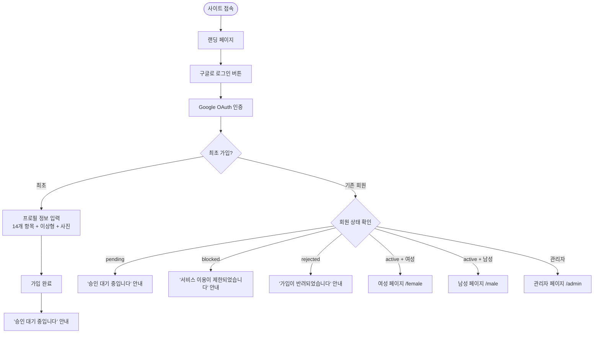
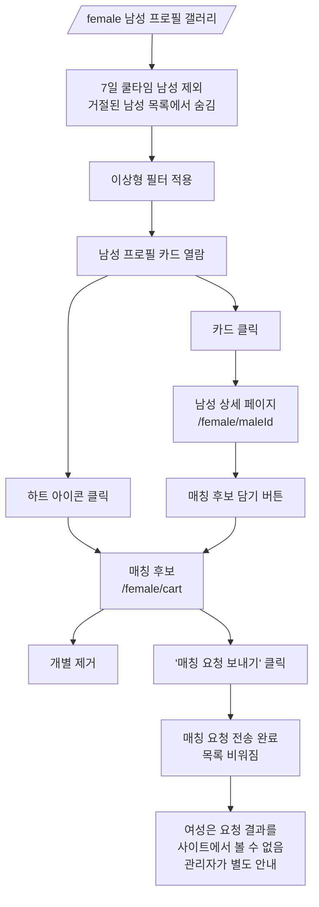
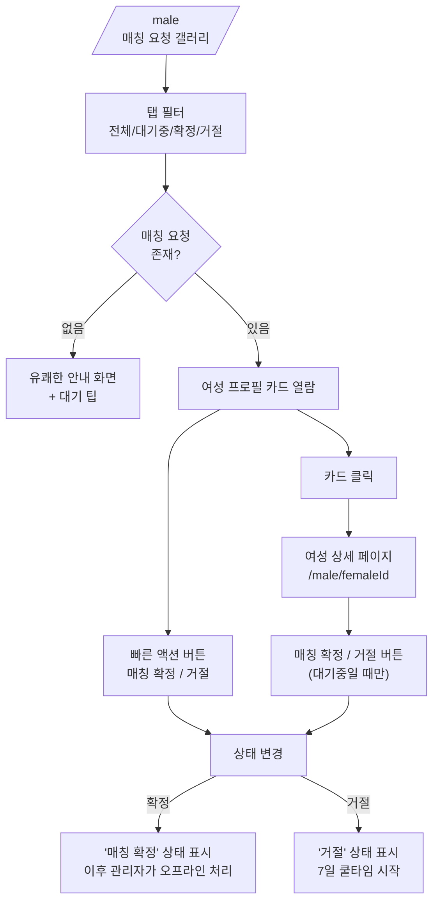
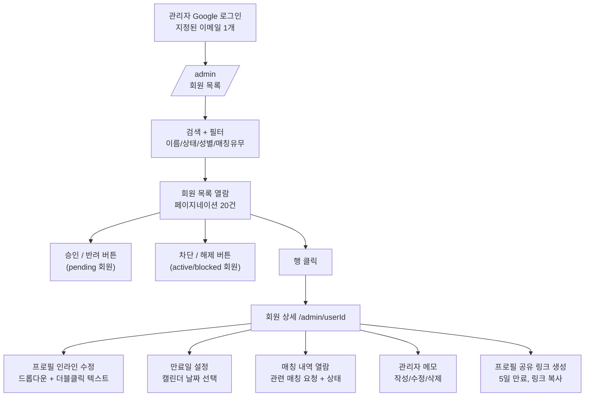
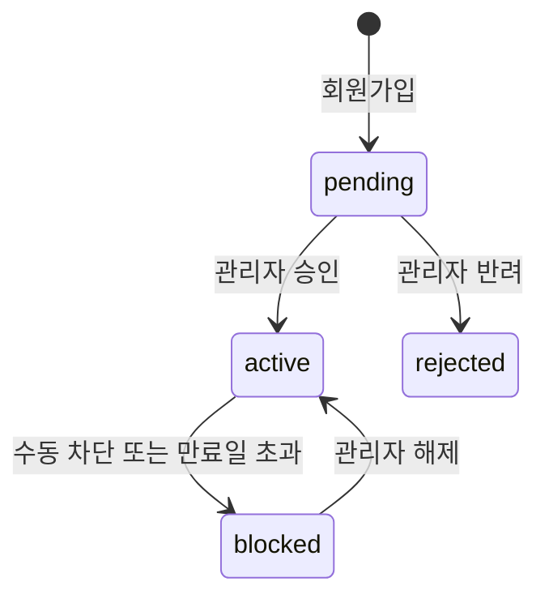
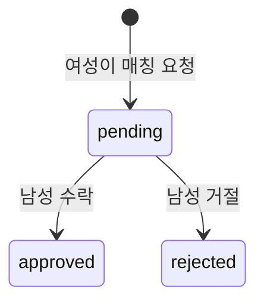

모두의 모임 - 상세 기능 명세서

버전: 1.0
작성일: 2026-03-17
프로젝트: 모두의 모임 - 프로필 매칭 관리 사이트

---

1. 전체 서비스 플로우

1-1. 회원 가입 ~ 이용 플로우



1-2. 여성 회원 플로우



1-3. 남성 회원 플로우



1-4. 관리자 플로우



1-5. 프로필 공유 링크 플로우

```mermaid
flowchart TD
    Admin[관리자] --> SelectUser[아무 회원 선택]
    SelectUser --> GenLink["프로필 링크 생성\n토큰 기반, 5일 만료"]
    GenLink --> CopyLink[링크 복사]
    CopyLink --> SendExternal["외부 전달\n(카톡/문자 등)"]
    SendExternal --> Recipient[링크 수신자]
    Recipient --> OpenLink[/profile/token 접속\n로그인 불필요]
    OpenLink --> ValidCheck{만료 여부\n확인}
    ValidCheck -->|유효| ViewProfile["프로필 열람\n(연락처/이메일/비밀번호 제외)"]
    ValidCheck -->|만료| ExpiredMsg["'링크가 만료되었습니다' 안내"]
```

---

2. 화면별 상세 기능 명세

2-1. 회원가입 페이지 (/register)

| 구분 | 설명 |
|------|------|
| 경로 | /register |
| 접근 권한 | Google 로그인 완료 후 최초 접속 시 자동 이동 |
| 목적 | 신규 회원 프로필 등록 |

인증:
- Google OAuth를 통해 로그인하면 이메일은 자동 수집
- 최초 로그인 시 프로필이 없으면 이 페이지로 자동 이동

입력 구성:

| 단계 | 항목 | 입력 방식 | 필수 |
|------|------|-----------|------|
| 기본 | 성별 | 선택 (남자/여자) | O |
| 프로필 | 성함 | 텍스트 입력 | O |
| 프로필 | 출생년도 | 선택 (2006년 ~ 1981년) | O |
| 프로필 | 거주지 - 시/도 | 선택 (서울/경기/인천/그 외 지역) | O |
| 프로필 | 거주지 - 구역 | 선택 (동부/서부/남부/북부, 시/도에 따라 동적) | 시/도에 따라 |
| 프로필 | 학력 | 선택 (10개 옵션) | O |
| 프로필 | 키 | 텍스트 입력 (숫자) | O |
| 프로필 | 직무 | 텍스트 입력 (예: 공무원_행정직, IT회사_개발자) | O |
| 프로필 | 직업 형태 | 선택 (8개 옵션) | O |
| 프로필 | 연봉 | 선택 (9개 옵션) | O |
| 프로필 | 흡연 | 선택 (흡연(연초)/흡연(전자담배)/비흡연) | O |
| 프로필 | MBTI | 선택 (16개 옵션) | O |
| 프로필 | 매력포인트 | 자유 텍스트 입력 | O |
| 프로필 | 연애스타일 | 자유 텍스트 입력 | O |
| 프로필 | 연락처 | 텍스트 입력 (01012345678 형식) | O |
| 프로필 | 프로필 사진 | 이미지 업로드 (최대 3장) | O |
| 이상형 | 이상형 키 | 선택 (키 범위) | O |
| 이상형 | 이상형 나이 | 선택 (나이 범위) | O |
| 이상형 | 이상형 거주지 | 선택 (시/도 + 구역) | O |
| 이상형 | 이상형 흡연여부 | 선택 (흡연(연초)/흡연(전자담배)/비흡연) | O |
| 이상형 | 이상형 학력 | 선택 (10개 옵션) | O |
| 이상형 | 이상형 직업 형태 | 선택 (8개 옵션) | O |
| 이상형 | 이상형 연봉 | 선택 (9개 옵션) | O |
| 이상형 | 우선순위 | 선택 (키/나이/거주지/학력/흡연여부/직업형태/연봉) | O |

동작:
- 가입 완료 시 회원 상태는 'pending'으로 설정
- 완료 후 '승인 대기 중입니다' 안내 화면 표시

---

2-2. 로그인 페이지 (/login)

| 구분 | 설명 |
|------|------|
| 경로 | /login |
| 접근 권한 | 비회원 |
| 목적 | Google OAuth 인증 및 역할별 페이지 분기 |

인증 방식:
- 'Google로 로그인' 버튼 클릭 → Google OAuth 인증

로그인 후 분기:

| 상황 | 동작 |
|------|------|
| 최초 로그인 (프로필 없음) | /register 프로필 입력 페이지로 이동 |
| pending | '승인 대기 중입니다' 안내 메시지 표시 |
| active + 여성 | /female 로 이동 |
| active + 남성 | /male 로 이동 |
| blocked | '서비스 이용이 제한되었습니다' 안내 메시지 표시 |
| rejected | '가입이 반려되었습니다' 안내 메시지 표시 |
| 관리자 (admins 테이블 이메일 일치) | /admin 으로 이동 |

---

2-3. 여성 회원 메인 페이지 (/female)

| 구분 | 설명 |
|------|------|
| 경로 | /female |
| 접근 권한 | active 상태 여성 회원 |
| 목적 | 승인된 남성 프로필 갤러리 열람 및 매칭 후보 담기 |

레이아웃:
- PC: 1줄 4개 카드 (그리드)
- 모바일: 1줄 2개 카드
- 이미지 중심 카드 디자인

카드 표시 정보:
- 프로필 사진 (대표 1장)
- 이름
- 나이 (출생년도 기반 계산)
- 키
- 거주지 (시/도 + 구역)
- 직업 형태
- MBTI

기능:
- 이상형 필터 (토글로 펼치기/접기)
  - 필터 항목: 키, 나이, 거주지, 흡연, 학력, 직업형태, 연봉
  - 필터 적용 시 실시간 목록 갱신
- 하트 아이콘: 매칭 후보에 담기/빼기 (토글)
- 카드 클릭: /female/[maleId] 상세 페이지로 이동
- 상세 페이지에서 뒤로가기 시 이전 스크롤 위치 복원 (맨 위로 이동하지 않음)
- 매칭 후보 페이지 이동 링크 (/female/cart)
- 7일 쿨타임 중인 남성은 목록에서 제외

데이터 조건:
- users.status = 'active' 인 남성만 표시
- 거절 후 7일 쿨타임 중인 남성 제외 (rejection_logs.visible_after > now())
- 최신 가입순 정렬
- 페이지네이션 (20건)

---

2-4. 남성 프로필 상세 페이지 (/female/[maleId])

| 구분 | 설명 |
|------|------|
| 경로 | /female/[maleId] |
| 접근 권한 | active 상태 여성 회원 |
| 목적 | 남성 프로필 전체 정보 열람 |

표시 정보:
- 프로필 사진 (최대 3장, 슬라이드 또는 나열)
- 이름
- 출생년도 / 나이
- 키
- 거주지 (시/도 + 구역)
- 학력
- 직무 (자유 텍스트)
- 직업 형태
- 연봉
- 흡연
- MBTI
- 매력포인트
- 연애스타일

제외 정보:
- 연락처
- 이메일
- 비밀번호
- 이상형 정보

기능:
- '매칭 후보에 담기' / '매칭 후보에서 빼기' 버튼 (토글)
- 뒤로가기 (갤러리로 복귀)

---

2-5. 매칭 후보 페이지 (/female/cart)

| 구분 | 설명 |
|------|------|
| 경로 | /female/cart |
| 접근 권한 | active 상태 여성 회원 |
| 목적 | 담은 남성 프로필 확인 및 일괄 매칭 요청 전송 |

표시:
- 담은 남성 프로필 목록 (사진, 이름, 주요 정보)
- 각 항목에 개별 제거 버튼

기능:
- 개별 프로필 제거
- 프로필 클릭 시 상세 페이지 이동 (/female/[maleId])
- '매칭 요청 보내기' 버튼
  - 클릭 시 목록에 담긴 모든 남성에게 일괄 매칭 요청 전송
  - 전송 완료 후 목록 비워짐
  - 완료 안내 메시지 표시

비즈니스 규칙:
- 7일 쿨타임 중인 남성은 갤러리에서 이미 제외되므로 요청 목록에 담길 수 없음 (이중 안전장치)
- 이미 대기 중인 매칭 요청이 있는 남성은 중복 요청 불가

---

2-6. 남성 회원 메인 페이지 (/male)

| 구분 | 설명 |
|------|------|
| 경로 | /male |
| 접근 권한 | active 상태 남성 회원 |
| 목적 | 자신에게 들어온 매칭 요청 열람 및 수락/거절 |

레이아웃:
- PC: 1줄 4개 카드 (그리드)
- 모바일: 1줄 2개 카드
- 이미지 중심 카드 디자인

탭 필터:
| 탭 | 표시 대상 |
|----|-----------|
| 전체 | 모든 매칭 요청 |
| 대기중 | status = 'pending' |
| 매칭 확정 | status = 'approved' |
| 거절 | status = 'rejected' |

카드 표시 정보:
- 프로필 사진 (대표 1장)
- 이름
- 나이
- 키
- 거주지
- 직업 형태
- MBTI
- 매칭 요청 상태 (대기중/확정/거절)

기능:
- 대기중 상태 카드: '매칭 확정' / '거절' 빠른 액션 버튼
- 카드 클릭: /male/[femaleId] 상세 페이지로 이동
- 상세 페이지에서 뒤로가기 시 이전 스크롤 위치 복원 (맨 위로 이동하지 않음)

매칭 요청 없는 경우:
- 유쾌한 안내 화면 표시
- 예시 문구: "많은 여성분들이 고객님의 프로필을 보고 있습니다"
- 대기 팁 안내

---

2-7. 여성 프로필 상세 페이지 (/male/[femaleId])

| 구분 | 설명 |
|------|------|
| 경로 | /male/[femaleId] |
| 접근 권한 | active 상태 남성 회원 (해당 여성이 매칭 요청을 보낸 경우만) |
| 목적 | 자신을 선택한 여성의 프로필 전체 정보 열람 및 수락/거절 |

표시 정보:
- 프로필 사진 (최대 3장)
- 이름
- 출생년도 / 나이
- 키
- 거주지 (시/도 + 구역)
- 학력
- 직무
- 직업 형태
- 연봉
- 흡연
- MBTI
- 매력포인트
- 연애스타일

제외 정보:
- 연락처
- 이메일
- 비밀번호
- 이상형 정보

기능:
- 대기 중(pending) 요청인 경우: '매칭 확정' / '거절' 버튼 표시
- 매칭 확정 완료: '매칭이 확정되었습니다!' 메시지 표시
- 거절 완료: '거절된 요청입니다' 메시지 표시
- 뒤로가기

---

2-8. 관리자 메인 페이지 (/admin)

| 구분 | 설명 |
|------|------|
| 경로 | /admin |
| 접근 권한 | 관리자 (admins 테이블에 등록된 Google 계정) |
| 목적 | 전체 회원 관리 |

관리자 인증:
- admins 테이블에 미리 등록된 구글 이메일 1개
- 일반 회원과 동일하게 Google OAuth로 로그인
- 로그인 시 admins 테이블에 이메일이 존재하면 /admin으로 분기

회원 목록:

| 기능 | 설명 |
|------|------|
| 검색 | 이름으로 검색 |
| 필터 - 상태 | 전체/승인대기/활성/차단/반려 |
| 필터 - 성별 | 전체/남성/여성 |
| 필터 - 매칭 | 전체/매칭있음/매칭확정있음/대기중있음/거절있음/매칭없음 |
| 정렬 | 최신 가입순 (created_at DESC) |
| 페이지네이션 | 20건 단위 |

회원 행 표시 정보:
- 프로필 사진 (썸네일)
- 이름
- 상태 (pending/active/blocked/rejected)
- 성별
- 출생년도, 키, 거주지, 직업형태 (요약)
- NEW 딱지: 가입 후 24시간 이내 회원
- 매칭 배지: 해당 회원의 매칭 건수 (전체/확정/대기/거절)
- 만료일 (설정된 경우)

액션 버튼:

| 회원 상태 | 가능한 액션 |
|-----------|------------|
| pending | 승인, 반려 |
| active | 차단 |
| blocked | 해제 |
| rejected | (액션 없음) |

행 클릭: /admin/[userId] 상세 페이지로 이동

---

2-9. 관리자 회원 상세 페이지 (/admin/[userId])

| 구분 | 설명 |
|------|------|
| 경로 | /admin/[userId] |
| 접근 권한 | 관리자 |
| 목적 | 개별 회원 프로필 열람/수정, 매칭 현황 확인, 프로필 링크 생성 |

프로필 정보 열람 및 수정:

| 항목 | 수정 방식 |
|------|-----------|
| 이름 | 더블클릭 -> 텍스트 입력 |
| 출생년도 | 드롭다운 선택 |
| 거주지 (시/도) | 드롭다운 선택 |
| 거주지 (구역) | 드롭다운 선택 (시/도에 따라 동적) |
| 학력 | 드롭다운 선택 |
| 키 | 더블클릭 -> 텍스트 입력 |
| 직무 | 더블클릭 -> 텍스트 입력 |
| 직업 형태 | 드롭다운 선택 |
| 연봉 | 드롭다운 선택 |
| 흡연 | 드롭다운 선택 |
| MBTI | 드롭다운 선택 |
| 매력포인트 | 더블클릭 -> 텍스트 입력 |
| 연애스타일 | 더블클릭 -> 텍스트 입력 |
| 연락처 | 더블클릭 -> 텍스트 입력 |

이상형 정보 열람 및 수정:

| 항목 | 수정 방식 |
|------|-----------|
| 이상형 키 | 드롭다운 선택 |
| 이상형 나이 | 드롭다운 선택 |
| 이상형 거주지 | 드롭다운 선택 |
| 이상형 흡연여부 | 드롭다운 선택 |
| 이상형 학력 | 드롭다운 선택 |
| 이상형 직업 형태 | 드롭다운 선택 |
| 이상형 연봉 | 드롭다운 선택 |
| 우선순위 | 드롭다운 선택 |

만료일 관리:
- 캘린더(date picker)로 만료일 설정
- 만료일 초과 시 자동으로 회원 상태가 blocked로 변경 (크론잡)

매칭 내역:
- 해당 회원과 관련된 모든 매칭 후보
- 표시: 상대방 이름, 요청일, 상태 (대기중/확정/거절), 응답일

프로필 공유 링크:
- '프로필 링크 생성' 버튼
- 클릭 시 5일 만료 토큰 링크 생성
- 생성된 링크 복사 버튼
- 남녀 회원 모두 링크 생성 가능

관리자 메모:
- 해당 회원에 대한 메모를 자유롭게 작성/수정/삭제 가능
- 여러 건의 메모 작성 가능 (시간순 표시)
- 메모는 관리자만 볼 수 있으며 회원에게 노출되지 않음
- 데이터: admin_notes 테이블

상태 관리:
- 승인/반려/차단/해제 버튼 (회원 상태에 따라 표시)

---

2-10. 프로필 공유 페이지 (/profile/[token])

| 구분 | 설명 |
|------|------|
| 경로 | /profile/[token] |
| 접근 권한 | 누구나 (토큰 기반, 로그인 불필요) |
| 목적 | 외부 공유용 프로필 열람 (이탈 방지 목적) |

표시 정보:
- 프로필 사진
- 이름
- 출생년도 / 나이
- 키
- 거주지
- 학력
- 직무
- 직업 형태
- 연봉
- 흡연
- MBTI
- 매력포인트
- 연애스타일

제외 정보:
- 연락처
- 이메일
- 비밀번호
- 이상형 정보

만료 처리:
- 링크 생성 후 5일 경과 시 만료
- 만료된 링크 접근 시 '이 링크는 만료되었습니다' 안내 화면 표시

---

3. 비즈니스 로직 명세

3-1. 회원 상태 관리

| 상태 | 설명 | 전이 가능 상태 |
|------|------|----------------|
| pending | 회원가입 직후 기본 상태 | active, rejected |
| active | 관리자 승인 완료, 서비스 이용 가능 | blocked |
| blocked | 차단 상태 (수동 차단 또는 만료일 초과 자동 차단) | active (해제 시) |
| rejected | 관리자 반려 | (최종 상태) |



3-2. 매칭 요청 상태 관리

| 상태 | 설명 |
|------|------|
| pending | 여성이 요청 전송, 남성 응답 대기 중 |
| approved | 남성이 수락 (매칭 확정) |
| rejected | 남성이 거절 |



매칭 확정 후:
- 사이트에서는 'approved' 상태만 표시
- 연락처 교환 등 후속 처리는 관리자가 오프라인으로 처리

여성 측 결과 확인:
- 여성 회원은 사이트에서 매칭 요청의 결과(수락/거절)를 직접 볼 수 없음
- 관리자가 별도로 안내

3-3. 거절 후 7일 쿨타임

- 남성이 여성의 매칭 요청을 거절하면 rejection_logs에 기록
- visible_after = rejected_at + 7일 (자동 계산)
- 쿨타임 기간 동안:
  - 해당 여성은 해당 남성에게 재요청 불가
  - 해당 여성의 갤러리에서 해당 남성이 표시되지 않음
- 7일 경과 후 자동으로 재요청 가능

3-4. 만료일 자동 블락

- 관리자가 회원별 만료일(expires_at) 설정
- 크론잡이 주기적으로 실행하여 expires_at < now() 인 active 회원을 자동으로 blocked 처리
- 블락된 회원은 로그인 시 '서비스 이용이 제한되었습니다' 안내
- 관리자가 수동으로 해제하거나 만료일을 연장하면 active로 복귀 가능

3-5. 프로필 공유 링크

- 관리자가 아무 회원(남성/여성 모두)의 프로필 공유 링크를 생성 가능
- 토큰 기반 URL 생성 (/profile/[token])
- 링크 유효 기간: 생성일로부터 5일
- 용도: 매칭이 잘 안 되는 회원의 이탈 방지 목적으로, 관리자가 해당 회원에게 이성 프로필 링크를 외부(카톡/문자 등)로 전달
- 링크 접근 시 로그인 불필요
- 민감 정보(연락처, 이메일, 비밀번호) 제외하고 프로필 표시

---

4. 프로필 입력 항목 정리

4-1. 프로필 기본 정보

| 번호 | 항목 | 필드명 | 입력 방식 | 선택지 | 이성 공개 |
|------|------|--------|-----------|--------|-----------|
| 1 | 성함 | name | 텍스트 입력 | - | O |
| 2 | 출생년도 | birth_year | 드롭다운 선택 | 2006년 ~ 1981년 (26개) | O |
| 3 | 성별 | gender | 선택 | 남자, 여자 | O |
| 4 | 거주지 (시/도) | city | 드롭다운 선택 | 서울, 경기, 인천, 그 외 지역 | O |
| 4-1 | 거주지 (구역) | district | 드롭다운 선택 | 동부, 서부, 남부, 북부 (서울/경기만 해당) | O |
| 5 | 학력 | education | 드롭다운 선택 | 박사 졸업, 석사 졸업, SKY카포 졸업, 의대/치대/한의대/약대 졸업, 로스쿨/경찰대/사관학교 졸업, 해외대학교 졸업, 서울 4년제 졸업, 기타 4년제 졸업, 전문대학교 졸업, 고등학교 졸업 | O |
| 6 | 키 | height | 텍스트 입력 (숫자) | - | O |
| 7 | 직무 | job | 텍스트 입력 | 자유 입력 (예: 공무원_행정직, IT회사_개발자) | O |
| 8 | 직업 형태 | job_type | 드롭다운 선택 | 전문직, 대기업, 중견기업, 중소기업, 공기업, 공무원, 개인사업/자영업, 프리랜서 | O |
| 9 | 연봉 | salary | 드롭다운 선택 | ~3,000만원 미만, 3,000만원 이상~4,000만원 미만, 4,000만원 이상~6,000만원 미만, 6,000만원 이상~8,000만원 미만, 8,000만원 이상~1억원 미만, 1억원 이상~1억 5천 미만, 1억 5천 이상~2억 미만, 2억 이상~, 3억 이상~ | O |
| 10 | 흡연 | smoking | 드롭다운 선택 | 흡연(연초), 흡연(전자담배), 비흡연 | O |
| 11 | MBTI | mbti | 드롭다운 선택 | ISTJ, ISFJ, INFJ, INTJ, ISTP, ISFP, INFP, INTP, ESTP, ESFP, ENFP, ENTP, ESTJ, ESFJ, ENFJ, ENTJ | O |
| 12 | 매력포인트 | charm | 자유 텍스트 입력 | - | O |
| 13 | 연애스타일 | dating_style | 자유 텍스트 입력 | - | O |
| 14 | 연락처 | phone | 텍스트 입력 | 01012345678 형식 | X (관리자만 열람) |
| - | 프로필 사진 | photo_urls | 이미지 업로드 | 최대 3장 | O |

4-2. 이상형 정보

| 번호 | 항목 | 필드명 | 입력 방식 | 선택지 |
|------|------|--------|-----------|--------|
| 1 | 이상형 키 | ideal_height | 드롭다운 선택 | 151~155, 156~160, 161~165, 166~170, 171~175, 176~180, 181~185, 185 이상 |
| 2 | 이상형 나이 | ideal_age | 드롭다운 선택 | 2006년~1997년, 1996년~1994년, 1993년~1990년, 1989년~1987년, 1986년~1984년, 1983년~1981년 |
| 3 | 이상형 거주지 | ideal_city / ideal_district | 드롭다운 선택 | 시/도 + 구역 (프로필 거주지와 동일 선택지) |
| 4 | 이상형 흡연여부 | ideal_smoking | 드롭다운 선택 | 비흡연, 흡연(전자담배), 흡연(연초) |
| 5 | 이상형 학력 | ideal_education | 드롭다운 선택 | 프로필 학력과 동일 선택지 (10개) |
| 6 | 이상형 직업 형태 | ideal_job_type | 드롭다운 선택 | 프로필 직업 형태와 동일 선택지 (8개) |
| 7 | 이상형 연봉 | ideal_salary | 드롭다운 선택 | 프로필 연봉과 동일 선택지 (9개) |
| 8 | 우선순위 | priority | 드롭다운 선택 | 키, 나이, 거주지, 학력, 흡연 여부, 직업 형태, 연봉 |

---

5. 기술 스택

| 구분 | 기술 |
|------|------|
| 프레임워크 | Next.js 14 (App Router, TypeScript) |
| 스타일링 | Tailwind CSS |
| 데이터베이스 | Supabase (PostgreSQL) |
| DB 쿼리 | Raw SQL (pg / Supabase JS Client) |
| 인증 | Supabase Auth |
| 이미지 저장 | Supabase Storage |
| 배포 | Vercel |
| 크론잡 | Vercel Cron 또는 Supabase Edge Functions |
| 반응형 | 모바일 / PC 대응 |

---

6. 페이지 라우트 맵

| 경로 | 페이지 | 접근 권한 |
|------|--------|-----------|
| / | 랜딩 페이지 | 모두 |
| /register | 회원가입 | 비회원 |
| /login | 로그인 | 비회원 |
| /female | 여성 메인 (남성 갤러리) | active 여성 |
| /female/[maleId] | 남성 프로필 상세 | active 여성 |
| /female/cart | 매칭 후보 | active 여성 |
| /male | 남성 메인 (매칭 요청 갤러리) | active 남성 |
| /male/[femaleId] | 여성 프로필 상세 | active 남성 |
| /admin | 관리자 메인 (회원 목록) | 관리자 |
| /admin/[userId] | 관리자 회원 상세 | 관리자 |
| /profile/[token] | 프로필 공유 (외부 링크) | 모두 (토큰 유효 시) |
